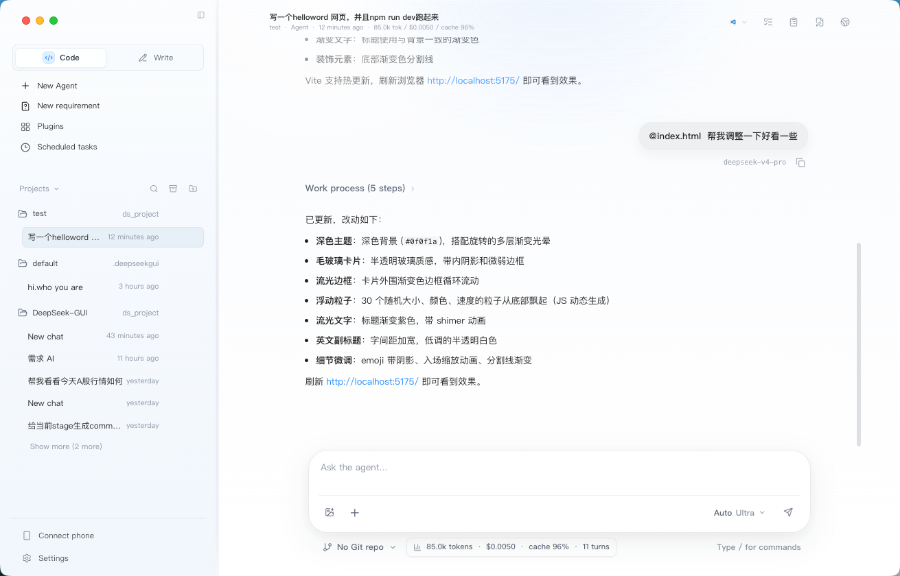
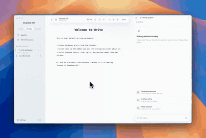
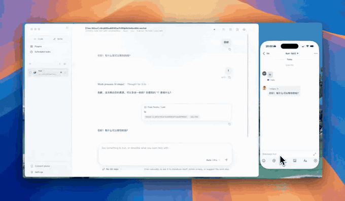
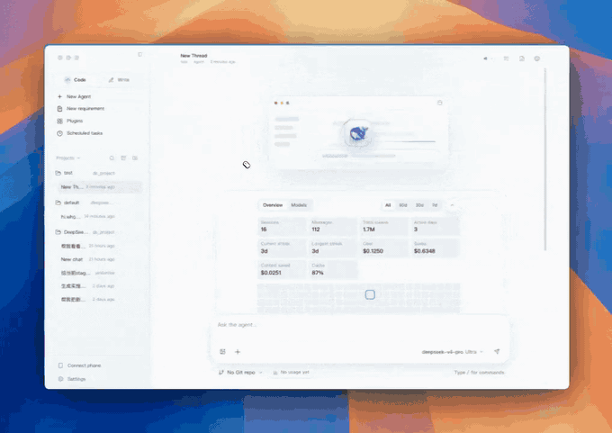
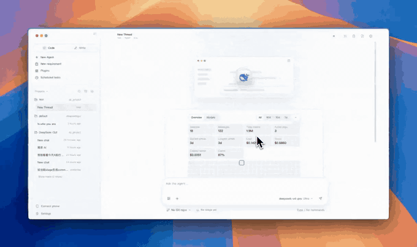

<p align="center">
  
</p>

<h1 align="center">DeepSeek GUI</h1>

<p align="center">
  <strong>🚀 把 Kun 高 Token ROI 智能体带进桌面 — Code / Write / Connect 一站式 AI 工作台</strong>
</p>

<p align="center">
  <a href="https://github.com/20090106-520/DeepSeek-GUI/releases">
    
  </a>
  <a href="./LICENSE">
    
  </a>
  
  
  
</p>

<p align="center">
  <a href="./README.en.md">English</a> | 简体中文
</p>

---

<p align="center">
  
</p>

<p align="center">
  <a href="src/asset/img/code.mp4">
    
  </a>
  <a href="src/asset/img/write.mp4">
    
  </a>
</p>

## ✨ 功能特性

### 💻 Code 模式 — 项目级 AI 开发工作台
- 🧠 **Kun 智能体** — Cache-first agent loop，高 Token ROI，稳定 prompt 前缀 + 按需工具上下文
- 📝 **流式推理** — 实时查看思维链、工具调用、文件改动，每一步都透明可控
- 🔍 **代码审查** — `/review` 一键审查未提交改动，findings 卡片呈现
- 📋 **需求与计划** — 新建需求草稿 → AI 澄清 → 一键生成实施计划，`/plan` `/goal` 追踪目标
- ✅ **变更审批** — 内联 diff + 侧边审查面板，对敏感操作逐条允许或拒绝

### ✍️ Write 模式 — Markdown 写作工作台
- 📂 **写作空间** — 独立文件树管理，Live / Source / Split / Preview 四种编辑模式
- 🤖 **AI 补全** — DeepSeek FIM 短补全 + 灵感长补全，BM25 跨文本检索增强
- 📤 **多格式导出** — HTML / PDF / DOC / DOCX 一键导出
- ✏️ **Inline Agent** — 选中文本直接唤起写作助手，润色/续写/摘要/大纲

### 📱 连接手机 — IM 自动化 + 定时任务
- 💬 **飞书 / Lark / 微信** — 独立 IM Agent，自定义人设、模型与工作目录
- ⏰ **定时任务** — 一次性 / 每日 / 间隔 / 手动，自动创建 Kun thread 执行
- 🔗 **Webhook / Relay** — 本地 webhook 接入团队协作或个人自动化

### 🎨 AI 多模态生成
- 🖼️ **图像生成** — Agnes Image 2.1 Flash，支持文生图 + 图片编辑
- 🎬 **视频生成** — Agnes Video V2.0，异步生成 + 内嵌播放器
- 🎭 **短剧工作室** — AI 短视频创作，分镜编排 + 配音 + 字幕 + 背景音乐
- 🔄 **双 API 备用** — 主 API 限速自动切换备用 API，零中断体验

### 🔌 插件 & 扩展
- 🛒 **插件市场** — MCP Server / Kun Skill 图形化管理，分类筛选 + 热度排序
- 🔧 **Computer Use** — @anthropic-ai/computer-use-mcp，截屏/鼠标/键盘桌面控制
- 🌐 **Web 工具** — web_fetch / web_search，联网搜索与页面抓取
- 🧩 **工作流编排** — 多步骤顺序执行，可视化任务流

### 🛡️ 工程质量
- 🔐 **隐私优先** — API Key 本地加密存储，所有数据保存在本机
- 🌍 **中英双语** — 界面语言随时切换，i18n 全覆盖
- 🎯 **TypeScript 零错误** — 748 单元测试 + 11 E2E 测试全部通过
- 📦 **跨平台** — Windows / macOS / Linux 预构建安装包

---

## 🏗️ 项目架构

```
┌─────────────────────────────────────────────────────────┐
│                    DeepSeek GUI (Electron)               │
├─────────────┬──────────────┬────────────────────────────┤
│   Main      │   Preload    │   Renderer (React 19)      │
│   Process   │   Bridge     │                             │
│             │              │  ┌──────────┐ ┌──────────┐ │
│  ┌───────┐  │              │  │ Code     │ │ Write    │ │
│  │Kun    │  │  dsGui API   │  │ Workbench│ │ Mode     │ │
│  │Adapter│◄─┼──────────────┼─►│          │ │          │ │
│  └───┬───┘  │              │  ├──────────┤ ├──────────┤ │
│      │      │              │  │ Connect  │ │ Drama    │ │
│  ┌───▼───┐  │              │  │ Phone    │ │ Studio   │ │
│  │Kun    │  │              │  ├──────────┤ ├──────────┤ │
│  │Serve  │  │              │  │ Plugin   │ │ Workflow │ │
│  │(HTTP/ │  │              │  │ Market   │ │ Editor   │ │
│  │ SSE)  │  │              │  └──────────┘ └──────────┘ │
│  └───────┘  │              │                             │
├─────────────┴──────────────┴────────────────────────────┤
│  Kun Agent Runtime (TypeScript)                         │
│  Cache-first Loop · MCP · Skills · Memory · Sub-agents  │
└─────────────────────────────────────────────────────────┘
```

**技术栈：** Electron 34 · React 19 · TypeScript · Zustand · Vite · Tailwind CSS · Playwright

---

## ⚡ 快速开始

### 一键安装

前往 [GitHub Releases](https://github.com/20090106-520/DeepSeek-GUI/releases/latest) 下载最新安装包：

| 平台 | 安装包 |
| --- | --- |
| 🪟 Windows | `DeepSeek-GUI-{version}-win-x64.exe` |
| 🍎 macOS | `.dmg` 或 `.zip`（Intel / Apple Silicon） |
| 🐧 Linux | `.AppImage` |

### 一键运行（开发者）

```bash
git clone https://github.com/20090106-520/DeepSeek-GUI.git
cd DeepSeek-GUI
npm install
npm run dev
```

> 💡 中国大陆用户：`npm install --registry=https://registry.npmmirror.com`

**环境要求：** Node.js 20+ · [DeepSeek API Key](https://platform.deepseek.com/api_keys)

### 首次使用

1. 🚀 启动 DeepSeek GUI
2. 🌍 选择界面语言（中文/English）
3. 🔑 填入 DeepSeek API Key（也支持 OpenAI 兼容服务）
4. 📂 选择工作目录
5. 💬 新建会话，开始对话！

---

## 🎬 更多演示

<p align="center">
  <a href="src/asset/img/feishu.mp4">
    
  </a>
</p>
<p align="center"><em>飞书 / Lark / 微信连接演示</em></p>

<p align="center">
  <a href="src/asset/img/sdd.mp4">
    
  </a>
</p>
<p align="center"><em>新建需求与计划演示</em></p>

<p align="center">
  <a href="src/asset/img/web.mp4">
    
  </a>
</p>
<p align="center"><em>Web 工具演示</em></p>

---

## 🧠 Kun：高 Token ROI 运行时

Kun 把"省 token"做成 agent loop 的默认行为，而不是事后补救：

| Kun 优势 | Token ROI 来源 |
| --- | --- |
| **Cache-first agent loop** | 稳定 system prompt + 工具 schema，DeepSeek 原生缓存高命中 |
| **按需工具上下文** | `mcp_search` → `mcp_describe` → `mcp_call`，避免全量工具目录 |
| **上下文卫生** | 超长结果/重复循环/低价值历史边界压缩，保留代码+路径+错误+决策 |
| **可见的用量收益** | 运行时跟踪 cache hit/miss + token 用量，GUI 实时展示 |

> 详见 [Kun 架构文档](docs/kun-architecture.md) · [缓存优化文档](docs/kun-cache-optimization.md)

---

## 👥 适合谁

- 🧑‍💻 **开发者** — 想用 DeepSeek 处理真实代码库，但不想一直留在终端
- 👔 **团队** — 需要清楚看到智能体做了什么、改了哪些文件
- 📝 **写作者** — 需要独立写作空间 + AI 补全 + 多格式导出
- 🤖 **自动化爱好者** — 想把 DeepSeek 接入飞书/微信/定时任务

---

## ⚙️ 设置与快捷键

设置页集中管理：API Key / Base URL / 运行时端口 / 工具审批策略 / 语言主题 / Skill & MCP / 连接手机

| 按键 | 功能 |
| --- | --- |
| `Enter` | 发送消息 |
| `Shift+Enter` | 输入框换行 |
| `Ctrl+Enter` | 发送消息 |
| `Esc` | 关闭面板/退出浮层 |

---

## 🔨 从源码构建

```bash
npm run build           # 生产构建
npm run dist:win        # Windows 安装包
npm run dist:mac        # macOS 安装包
npm run dist:linux      # Linux AppImage
npm run test            # 单元测试 (748 tests)
npm run test:e2e        # E2E 测试 (11 tests)
npm run typecheck       # TypeScript 类型检查
```

---

## 📖 文档

| 文档 | 内容 |
| --- | --- |
| [Kun 架构](docs/kun-architecture.md) | 单运行时方案、HTTP/SSE 合约、旧 agent 拆除 |
| [Kun 缓存优化](docs/kun-cache-optimization.md) | Token economy、MCP search、工具输出压缩 |
| [Kun 贡献指南](docs/kun-contributing.md) | 六边形架构、设计模式、PR 场景 |
| [Kun CLI & API](kun/README.md) | CLI、env、data dir、HTTP API |
| [贡献说明](docs/CONTRIBUTING.zh-CN.md) | 协作约定与流程 |
| [开发流程](docs/DEVELOPMENT.zh-CN.md) | 本地开发与调试 |

---

## 🙏 致谢

- **Reasonix** — cache-first agent loop 设计原型
- **[LobsterAI](https://github.com/netease-youdao/LobsterAI)** — IM 管理、扫码绑定启发
- **OpenHanako** — Markdown live 编辑、写作空间参考
- **[DeepSeek](https://github.com/deepseek-ai)** — 提供模型与 API

<a href="https://github.com/20090106-520/DeepSeek-GUI/graphs/contributors">
  
</a>

> [!NOTE]
> 本项目为二次衍生修改项目，上游原项目：[XingYu-Zhong/DeepSeek-GUI](https://github.com/XingYu-Zhong/DeepSeek-GUI)，原生 MIT 协议。本项目与 DeepSeek Inc. 无隶属关系。

## 📄 许可证

[MIT](./LICENSE)

## ⭐ Star 历史

[](https://www.star-history.com/?repos=20090106-520%2FDeepSeek-GUI&type=date&logscale=&legend=top-left)
